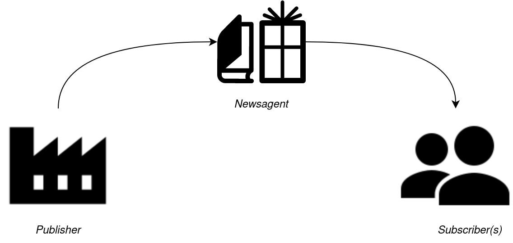

# ROS2 Tutorial : Publisher & Subscriber

## Contents

## What are they?

A ROS `publisher` is analogous to a newsagency. A literary publisher will print and distribute newspapers or magazines at regular intervals (daily, weekly, monthly) and make them publically available at places like a newsagent. Multiple people are then free to purchase or subscribe to the media that is relevant to their interests.



Similarly, a `publisher` node generates information and makes it publically available on the ROS network. A `subscriber` node can then obtain this information for its own use. Examples include:
- Sensor information:
     - Joint positions
     - Laser scans
     - Depth sensor
- Location information:
     - Robot pose
     - GPS location

It is suitable for any kind of information that is generated frequently.

In contrast, information that is required infrequently, and that might require some form of calculation or transformation, might be better distributed using a `client` and `server` paradigm. For example:
- Acquiring map updates
- Generating a new path plan

ROS has 3 types of communication paradigms:

| Sender        | Receiver      | Node Interaction | Periodicity |
|---------------|---------------|------------------|-------------|
| Publisher     | Subscriber    | Indirect         | Continuous  |
| Server        | Client        | Direct           | By request  |
| Action Server | Action Client | Direct           | By request with continuous updates  |

## The Tutorial

### 1. Create the package

i) Be sure to source ROS (if it isn't already in your .bashrc):
```
source /opt/ros/<distribution>/setup.bash
```
where `<distribution>` is the name of your ROS distribution (foxy, humble, etc.). Also source from the root of your ROS workspace:
```
source ./install/setup.bash
```
ii) In your ROS2 workspace, create a new package:

```
ros2 pkg create --dependencies rclcpp std_msgs -- tutorial_publisher_subscriber
```

### 2. Writing a Publisher

i) In the folder `tutorial_publisher_subscriber/src`, create `haiku_publisher.cpp` and insert the following code:
```
#include <rclcpp/rclcpp.hpp>                                                                        // Fundamental ROS2 C++ packages
#include <std_msgs/msg/string.hpp>                                                                  // String message type

  ////////////////////////////////////////////////////////////////////////////////////////////////////
 //                                            MAIN                                                //
////////////////////////////////////////////////////////////////////////////////////////////////////
int main(int argc, char* argv[])
{
     rclcpp::init(argc,argv);                                                                       // Starts up ROS2
     
     rclcpp::Node node("haiku_publisher");                                                          // Create node with name "haiku_publisher"

     rclcpp::Publisher<std_msgs::msg::String>::SharedPtr publisher
     = node.create_publisher<std_msgs::msg::String>("haiku",10);                                    // Advertise topic with given name, queue length 10
     
     rclcpp::Rate loopRate(1.0);                                                                    // Create loop timer of 1Hz
 
     RCLCPP_INFO(node.get_logger(), "Publishing haiku. "
                                    "Use 'ros2 topic echo /haiku' in another terminal to view output."); // Inform the user
     
     int line = 1;                                                                                  // Select which line of Haiku to publish
     
     // Run indefinitely until this node is forcibly cancelled
     while(rclcpp::ok())
     {
          std_msgs::msg::String message;                                                            // To be published
          
          if     (line == 1) message.data = "Worker bees can leave.";
          else if(line == 2) message.data = "Even drones can fly away.";
          else if(line == 3) message.data = "The Queen is their slave.";
          
          if(line < 3) line++;                                                                      // Go to next line of poem
          else         line = 1;                                                                    // Back to first

          publisher->publish(message);                                                              // Send message over ROS network
 
          loopRate.sleep();                                                                         // Regulate while() loop at given rate
     }
     
     return 0;                                                                                      // No problems with main()
}
```
ii) Modify the `CMakeLists.txt` file with the following code before the `ament_package()` line:
```
add_executable(haiku_publisher src/haiku_publisher.cpp)
ament_target_dependencies(haiku_publisher
                          "rclcpp"
                          "std_msgs")

# This is so ROS2 can find the executable when we call `ros2 run`                        
install(TARGETS
        haiku_publisher
        DESTINATION lib/${PROJECT_NAME}/
)
```
iii) Modify the `package.xml` file with the following:
```
<depend>rclcpp</depend>
<depend>std_msgs</depend>
```
iv) Return to the root of your ROS2 workspace and run:
```
colcon build --packages-select tutorial_publisher_subscriber
```
v) Start up the node:
```
ros2 run tutorial_publisher_subscriber haiku_publisher
```
vi) In another terminal, you can check the existance of the `/haiku` topic:
```
ros2 topic list
```
vii) You can check the haiku is being published using:
```
ros2 topic echo /haiku
```
#### The Code Explained

This line starts up the ROS2 (if its not already running):
```
rclcpp::init(argc,argv);
```
In these lines, we create a node object that is registered as `haiku_publisher` on the ROS network. Then we generate a publisher from said node, advertising the topic `haiku`, with a queue length of `10`:
```
rclcpp::Node node("haiku_publisher");

rclcpp::Publisher<std_msgs::msg::String>::SharedPtr publisher = node.create_publisher<std_msgs::msg::String>("haiku",10);
```
The while loop will run until the node is shut down:
```
while(rclcpp::ok())
{
     ...
}
```
The following line is what sends the string message over the ROS network:
```
publisher->publish(message);
```
And this line regulates the timing of the `while()` loop:
```
loopRate.sleep();
```

### Writing a Subscriber
