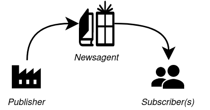
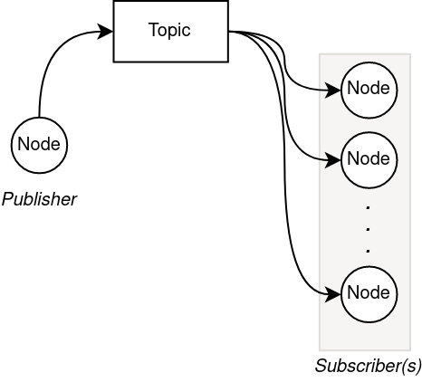

# ROS2 Tutorial : Publisher & Subscriber

:bangbang: _The new paradigm for ROS2 is to use Object Oriented Programming (OOP). These tutorials are in the style of ROS1, and are deliberately simplified to make it easier to understand._

## Contents

- [What is it?](#what-is-it)
- [The Tutorial](#the-tutorial)
     - [1. Writing a Publisher](#1-writing-a-publisher)
     - [2. Writing a Subscriber](#2-writing-a-subscriber)
 


## What is it?

A ROS `publisher` is analogous to a newsagency. A literary publisher will print and distribute newspapers or magazines at regular intervals (daily, weekly, monthly) and make them publically available at places like a newsagent. Multiple people are then free to purchase or subscribe to the media that is relevant to their interests.



Similarly, a `publisher` node generates information and makes it publically available on the ROS network. A `subscriber` node can then obtain this information for its own use. 



Publishers & subscribers are useful for information that is being generated continuously. Examples include:
- Sensor readings:
     - Joint positions
     - Laser scans
     - Depth sensors
- Location information:
     - GPS locations
     - Robot poses
     - etc.

In contrast, information that is required _infrequently_ (particularly if it requires some kind of calculation or transformation) might be better distributed using a `client` and `server` paradigm. For example:
- Acquiring map updates, or
- Generating a new path plan.

ROS has 3 types of communication paradigms:

| Sender        | Receiver      | Node Interaction | Periodicity |
|---------------|---------------|------------------|-------------|
| Publisher     | Subscriber    | Indirect         | Continuous  |
| Server        | Client        | Direct           | By request  |
| Action Server | Action Client | Direct           | By request, with continuous updates  |

:arrow_backward: [Go back.](#ros2-tutorial--publisher--subscriber)

## The Tutorial
_________________________
Be sure to source ROS (if it isn't already in your .bashrc):
```
source /opt/ros/<distribution>/setup.bash
```
where `<distribution>` is the name of your ROS distribution (foxy, humble, etc.).

In your ROS2 workspace, create a new package:
```
ros2 pkg create --dependencies rclcpp std_msgs -- tutorial_publisher_subscriber
```

### 1. Writing a Publisher
_____________________________

i) In the folder `tutorial_publisher_subscriber/src`, create `haiku_publisher.cpp` and insert the following code:
```
#include <rclcpp/rclcpp.hpp>                                                                        // Fundamental ROS2 C++ packages
#include <std_msgs/msg/string.hpp>                                                                  // String message type

  ////////////////////////////////////////////////////////////////////////////////////////////////////
 //                                            MAIN                                                //
////////////////////////////////////////////////////////////////////////////////////////////////////
int main(int argc, char* argv[])
{
     rclcpp::init(argc,argv);                                                                       // Starts up ROS2
     
     rclcpp::Node node("haiku_publisher");                                                          // Create node with name "haiku_publisher"

     rclcpp::Publisher<std_msgs::msg::String>::SharedPtr publisher
     = node.create_publisher<std_msgs::msg::String>("haiku",10);                                    // Advertise topic with given name, queue length 10
     
     rclcpp::Rate loopRate(1.0);                                                                    // Create loop timer of 1Hz
 
     RCLCPP_INFO(node.get_logger(), "Publishing haiku. "
                                    "Use 'ros2 topic echo /haiku' in another terminal to view output."); // Inform the user
     
     int line = 1;                                                                                  // Select which line of Haiku to publish
     
     // Run indefinitely until this node is forcibly cancelled
     while(rclcpp::ok())
     {
          std_msgs::msg::String message;                                                            // To be published
          
          if     (line == 1) message.data = "Worker bees can leave.";
          else if(line == 2) message.data = "Even drones can fly away.";
          else if(line == 3) message.data = "The Queen is their slave.";
          
          if(line < 3) line++;                                                                      // Go to next line of poem
          else         line = 1;                                                                    // Back to first

          publisher->publish(message);                                                              // Send message over ROS network
 
          loopRate.sleep();                                                                         // Regulate while() loop at given rate
     }
     
     return 0;                                                                                      // No problems with main()
}
```
ii) Modify the `CMakeLists.txt` file with the following code before the `ament_package()` line:
```
add_executable(haiku_publisher src/haiku_publisher.cpp)
ament_target_dependencies(haiku_publisher
                          "rclcpp"
                          "std_msgs")

# This is so ROS2 can find the executable when we call `ros2 run`                        
install(TARGETS
        haiku_publisher
        DESTINATION lib/${PROJECT_NAME}/
)
```
iii) Ensure the `package.xml` file has the following lines of code:
```
<depend>rclcpp</depend>
<depend>std_msgs</depend>
```
iv) Return to the root of your ROS2 workspace and run:
```
colcon build --packages-select tutorial_publisher_subscriber
```
v) Run the following command in the terminal so that ROS2 can find the newly created package:
```
source ./install/setup.bash
```
vi) Start up the node:
```
ros2 run tutorial_publisher_subscriber haiku_publisher
```
vii) Check the existance of the `/haiku` topic with the following command in another terminal:
```
ros2 topic list
```


viii) You can check the haiku is being published using:
```
ros2 topic echo /haiku
```


#### :mag: The Code Explained
_____________________________

This line starts up the ROS2 (if its not already running):
```
rclcpp::init(argc,argv);
```
In these lines, we:
1. Create a node object that is registered as `haiku_publisher` on the ROS network,
2. Generate a publisher from said node,
3. Advertise the topic `haiku`,
4. With a queue length of `10`:
```
rclcpp::Node node("haiku_publisher");

rclcpp::Publisher<std_msgs::msg::String>::SharedPtr publisher = node.create_publisher<std_msgs::msg::String>("haiku",10);
```
The while loop will run until the node is shut down:
```
while(rclcpp::ok())
{
     ...
}
```
The following line is what sends the string message over the ROS network:
```
publisher->publish(message);
```
And this line regulates the timing of the `while()` loop:
```
loopRate.sleep();
```

:arrow_backward: [Go back.](#ros2-tutorial--publisher--subscriber)

### 2. Writing a Subscriber
_______________________________________________________

i) In `tutorial_publisher_subscriber/src` create a file called `haiku_subscriber.cpp` and add the following code:
```
#include <rclcpp/rclcpp.hpp>                                                                        // Fundamental ROS2 C++ packages
#include <std_msgs/msg/string.hpp>                                                                  // String message type

using namespace std::placeholders;                                                                  // For the std::bind() function below

// NOTE: This style is no longer recommended with ROS2.
rclcpp::Node::SharedPtr node = nullptr;                                                             // Forward declaration     

/**
 * Forward declaration of callback function.
 * It reads the '/haiku' topic and prints out the message.
 * @param message A string message obtained from the specified ROS topic.
 */
void callback(const std_msgs::msg::String &message)
{
     RCLCPP_INFO(node->get_logger(), message.data.c_str());                                         // Print out message to console
}

  ////////////////////////////////////////////////////////////////////////////////////////////////////
 //                                            MAIN                                                //
////////////////////////////////////////////////////////////////////////////////////////////////////
int main(int argc, char* argv[])
{
     rclcpp::init(argc,argv);                                                                       // Starts up ROS2
     
     node = rclcpp::Node::make_shared("haiku_subscriber");                                          // Create and assign node to previously declared memory address

     rclcpp::Subscription<std_msgs::msg::String>::SharedPtr subscriber
     = node->create_subscription<std_msgs::msg::String>("haiku", 10, callback);                     // Create subscriber to "haiku" topic, queue length 10, using callback()
     
     RCLCPP_INFO(node->get_logger(), "Subscribing to '/haiku'.");                                   // Inform user
     
     rclcpp::spin(node);                                                                            // Run the node indefinitely
     
     rclcpp::shutdown();                                                                            // Shut down ROS
        
     return 0;                                                                                      // No problems with main()
}
```
ii) Add the following to `CMakeLists.txt`:
```
add_executable(haiku_subscriber src/haiku_subscriber.cpp)
ament_target_dependencies(haiku_subscriber
                          "rclcpp"
                          "std_msgs")
```
iii) Be sure to list `haiku_subscriber` to the install targets in `CMakeLists.txt` too:
```
install(TARGETS
        haiku_publisher
        haiku_subscriber
        DESTINATION lib/${PROJECT_NAME}/
)
```
iv) Navigate back to the root of your ROS2 workspace and run:
```
colcon build --packages-select tutorial_publisher_subscriber
```
v) Start the publisher node (if its not already running):
```
ros2 run tutorial_publisher_subscriber haiku_publisher
```
vi) Start the subscriber node:
```
ros2 run tutorial_publisher_subscriber haiku_subscriber
```
You should see the lines of the haiku being printed to the terminal window:


#### :mag: The Code Explained
_____________________________

This is a forward declaration with memory allocation so that the node can be read both in the scope of the `callback()` function and `main()`:
```
rclcpp::Node::SharedPtr node = nullptr;
```
:exclamation: It is not recommended that you code in this style. ROS2 recommends [object oriented programming](https://docs.ros.org/en/foxy/Tutorials/Beginner-Client-Libraries/Writing-A-Simple-Cpp-Publisher-And-Subscriber.html), though it is very complicated for beginners :eyes:

This callback function will be linked to an ensuing node. It will be executed every time a new message appears on the `/haiku` topic. It simply prints out the message it receives:
```
void callback(const std_msgs::msg::String &message)
{
     RCLCPP_INFO(node->get_logger(), message.data.c_str());
}
```
This assigns a node object to the memory address:
```
     node = rclcpp::Node::make_shared("haiku_subscriber");
```
In this line of code we:
1. Generate a subscriber from the previously declared node,
2. Tell it to read the `haiku` topic,
3. Store up to `10` messages, and
4. Execute the `callback` function whenever it receives a new message:
```
rclcpp::Subscription<std_msgs::msg::String>::SharedPtr subscriber = node->create_subscription<std_msgs::msg::String>("haiku", 10, callback);
```
Now we tell ROS to run the node and process received messages indefinitely:
```
rclcpp::spin(node);
```

:arrow_backward: [Go back.](#ros2-tutorial--publisher--subscriber)
